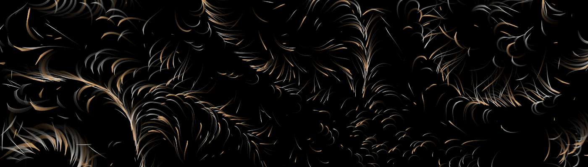
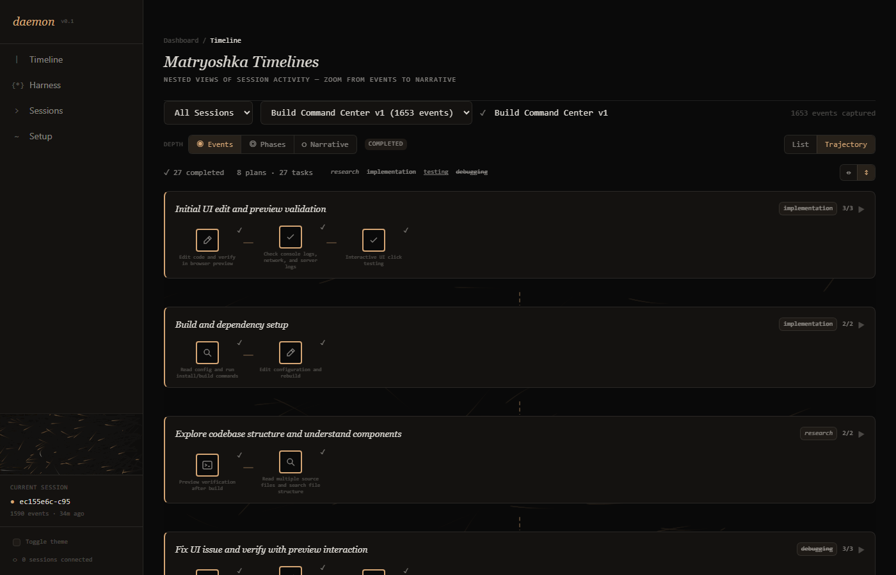
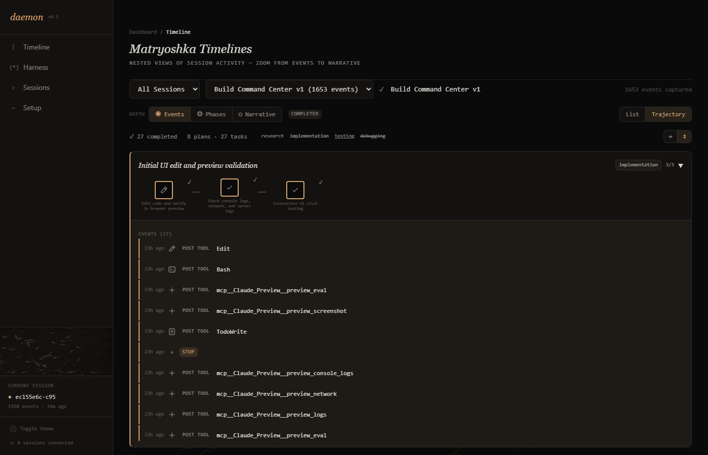
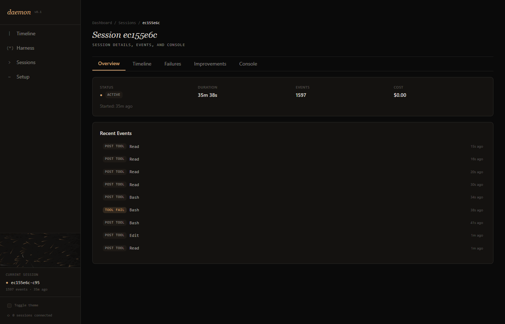

<p align="center">
  
</p>

<p align="center">
  <picture>
    <source media="(prefers-color-scheme: dark)" srcset="public/daemon-banner-dark.svg">
    <source media="(prefers-color-scheme: light)" srcset="public/daemon-banner-light.svg">
    
  </picture>
</p>

<h3 align="center"><em>watches the watchers</em></h3>

<p align="center">
  A monitoring system for long-running <a href="https://docs.anthropic.com/en/docs/claude-code">Claude Code</a> agents.<br>
  <sub>built by agents, watched by daemon, improved by humans.</sub>
</p>

<p align="center">
  <a href="#the-problem">The Problem</a> ·
  <a href="#what-daemon-does">What It Does</a> ·
  <a href="#harness-engineering">Harness Engineering</a> ·
  <a href="./docs/setup.md">Setup</a> ·
  <a href="./docs/architecture.md">Architecture</a>
</p>

---

<br>

> *When codebases become optimised harness-engineered systems, agents run for hours across multiple context compaction horizons. They make thousands of tool calls, hit failures they silently recover from, and leave behind sessions that no human has time to read end-to-end.*
>
> *Someone needs to watch the watchers.*

<br>

<p align="center">
  
  <br>
  <sub><em>the timeline — plans within plans, tasks within tasks, events within events</em></sub>
</p>

<br>

## The problem

Agents work autonomously for hours. Sometimes while their operators sleep. A single Claude Code session can span hundreds of tool calls, multiple context compactions, and several hours of wall-clock time.

When something goes wrong, you get a failed PR.

When something goes *subtly* wrong, you get nothing at all — just a session that looks fine on the surface but made poor architectural decisions, repeated work across compaction boundaries, or silently swallowed errors that will compound later.

```
  What did the agent actually do during that six-hour session?
  Where did it fail, and what evidence exists?
  What patterns keep recurring?
  How can the harness be improved to prevent these failures?
```

<br>

## What daemon does

Daemon ingests events from Claude Code sessions via **HTTP hooks** and **OpenTelemetry**, then lets you explore what happened at whatever depth you need.

<br>

### ◎ Multi-resolution exploration

Three levels of depth. Pick the one that matches your question.

```
  ┌─────────────────────────────────────────────────┐
  │  Narrative    what happened, in thirty seconds   │
  ├─────────────────────────────────────────────────┤
  │  Phases       research → implementation →        │
  │               testing → debugging                │
  ├─────────────────────────────────────────────────┤
  │  Events       every tool call, every decision    │
  └─────────────────────────────────────────────────┘
```

<p align="center">
  
  <br>
  <sub><em>drill down — expand any plan to see the raw events underneath</em></sub>
</p>

<br>

### ✗ Failure analysis with evidence

Not just *what* failed — *why*, with the receipts. Every failure links back to its source events: the tool calls that preceded it, the error messages, the recovery attempts. The full causal chain.

Classified by impact (`critical` · `warning` · `info`) and type (`tool_failure` · `api_error` · `logic_error` · `timeout` · `permission_denied`).

<br>

### ◆ Actionable improvement recommendations

Every failure pattern comes paired with a recommendation targeting the harness itself:

```
  hooks           auto-enforcement, pre/post-tool hooks
  skills          reusable /commands for common workflows
  subagents       agent teams for parallel work
  tools           MCP servers, integrations
  context         CLAUDE.md, architecture docs
  architecture    layer boundaries, structural lints
  legibility      agent-friendly code organisation
```

The agent works → daemon watches → the human improves the harness → the agent works better.

<br>

### ● Live session monitoring

<p align="center">
  
  <br>
  <sub><em>a live session — 1597 events, tool calls streaming in, failures highlighted in ember</em></sub>
</p>

<br>

---

<br>

## Harness engineering

Daemon is built on the principles of **harness engineering** — the discipline of designing environments where agents can do reliable, autonomous work.

The term comes from the infrastructure surrounding a long-running agent: the CLAUDE.md that gives it direction, the hooks that enforce invariants, the tools that extend its capabilities, the feedback loops that catch failures before they compound. Engineering this well is what separates a productive agent from one that drifts.

The foundational ideas draw from:

> **"Harness engineering: leveraging Codex in an agent-first world"** — the engineer's job is no longer writing code but designing environments, specifying intent, and building feedback loops.

> **"Effective Harnesses for Long-Running Agents"** — agents working across context compaction boundaries need structured artifacts to bridge the gap between sessions.

> **"Long-running Claude for scientific computing"** — progress files as portable long-term memory, reference implementations as test oracles, git as the coordination mechanism.

Where harness engineering tells you *how to build the environment*, daemon tells you *how well the environment is working*.

See [docs/harness-engineering.md](./docs/harness-engineering.md) for the deep dive.

<br>

---

<br>

## How it works

Daemon monitors **Claude Code** sessions through two channels:

```
  Claude Code ──── HTTP hooks ───→ POST /api/events ───→ ┐
                                                          ├──→ SQLite ──→ Analysis ──→ UI
  Claude Code ──── OpenTelemetry ─→ POST /api/otel ────→ ┘
```

When you trigger analysis, daemon spawns a Claude agent that processes the session's event stream and produces structured timeline, failure, and improvement results.

See [docs/setup.md](./docs/setup.md) for installation and configuration.

<br>

---

<br>

## Architecture

Domain-Driven Design backend. Feature-Sliced Design frontend. Three colours.

```
  src/
    server/
      domain/           pure entities, repository interfaces, ports
      application/      use cases orchestrating domain + infrastructure
      infrastructure/   SQLite, Claude runner, WebSocket, GraphQL
    shared/             UI primitives, utilities, hooks
    entities/           entity models and display components
    features/           timeline · failures · improvements · session · harness
    app/                Next.js pages and API routes
    prompts/            LLM prompt templates for analysis
```

See [docs/architecture.md](./docs/architecture.md) for the full technical breakdown.

<br>

## Design

```
  VOID     #0a0a0a    neon black, the deepest background
  BONE     #f0ece5    neon white, warm Anthropic parchment
  EMBER    #d4a574    Claude's warm amber, the only accent
```

Three colours. Symbols for status. Typography for hierarchy. Nothing else.

See [DESIGN.md](./DESIGN.md) for the full design system.

<br>

---

<br>

## Status

**Proof of concept** · v0.1

Daemon currently monitors Claude Code only. The core timeline, failure analysis, and improvement recommendation features are functional. The system was used to monitor its own development — Claude Code agents built daemon while daemon watched them work.

<br>

## Documentation

```
  docs/setup.md                 installation, hook connection, agent API
  docs/architecture.md          DDD backend, FSD frontend, data flows
  docs/harness-engineering.md   founding principles, daemon's position
  DESIGN.md                     three-colour visual language
```

<br>

## References

- [Harness engineering: leveraging Codex in an agent-first world](https://openai.com/index/harness-engineering/) — OpenAI, February 2026
- [Effective Harnesses for Long-Running Agents](https://www.anthropic.com/research/long-running-claude) — Anthropic, November 2025
- [Long-running Claude for scientific computing](https://www.anthropic.com/research/long-running-Claude) — Anthropic, March 2026

<br>

---

<p align="center"><em>daemon watches the watchers.</em></p>
